- Vidhish Trivedi - IMT2021055
- Barath S Narayan - IMT2021524
- Vikas Kalyanapuram - IMT2021040
- Teaching Assistant In-charge: Sarthak Harne
# Dataset Description
Kaggle Competition Link: [Canadian Hospital Re-admittance Challenge | Kaggle](https://www.kaggle.com/competitions/canadian-hospital-re-admittance-challenge/overview)

We were provided with a dataset containing records of patients who were admitted to hospitals in Canada. It presents us with demographic as well as diagnostic information for each record corresponding to a visit (encounter).

The aim of the challenge was to predict whether a patient would be *readmitted* within 30 days, after 30 days, or not at all.

*Readmission of a patient generally indicates incorrect diagnosis or prescription, resulting in the risk of side effects and wastage of resources for both the hospital and the patient. Predicting readmission can prevent this.*
### Description of Columns

| Column Name | Description |
| -------- | --------------------------------- |
| enc_id | Unique identifier of an encounter |
| patient_id | Unique identifier of a patient |
| race | Race of the person |
| gender | Gender of the person |
| age | Age of the person grouped in 10-year intervals |
|weight | Weight in pounds |
| admission_type_id | Integer identifier corresponding to 9 distinct values |
| discharge_disposition_id | Integer identifier corresponding to 29 distinct values |
| admission_source_id | Integer identifier corresponding to 21 distinct values |
|time_in_hospital | Integer number of days between admission and discharge |
| payer_code | Integer identifier corresponding to 23 distinct values |
| medical_specialty | Integer identifier of a specialty of the admitting physician, corresponding to 84 distinct values |
| num_lab_procedures | Number of lab tests performed during the encounter |
| num_procedures | Number of procedures (other than lab tests) performed during the encounter |
| num_medications | Number of distinct generic names administered during the encounter |
| number_outpatient | Number of outpatient visits of the patient in the year preceding the encounter |
| number_emergency | Number of emergency visits of the patient in the year preceding the encounter |
| number_inpatient | Number of inpatient visits of the patient in the year preceding the encounter |
| diag_1 | The primary diagnosis (coded as first three digits of ICD9) |
| diag_2 | Secondary diagnosis (coded as first three digits of ICD9) |
| diag_3 | Additional secondary diagnosis (coded as first three digits of ICD9) |
| number_diagnoses | Number of diagnoses entered to the system |
| max_glu_serum | Indicates the range of the result or if the test was not taken |
| A1Cresult | Indicates the range of the result or if the test was not taken |
| *Columns corresponding to drug dosage* | describe if there was any change in a given drug's dosage for this encounter. `["metformin", "repaglinide", "nateglinide", "chlorpropamide", "glimepiride", "acetohexamide", "glipizide", "glyburide", "tolbutamide", "pioglitazone", "rosiglitazone", "acarbose", "miglitol", "troglitazone", "tolazamide", "examide", "citoglipton", "insulin", "glyburide-metformin", "glipizide-metformin", "glimepiride-pioglitazone", "metformin-rosiglitazone", "metformin-pioglitazone"]` |
| change | Indicates if there was a change in diabetic medications (either dosage or generic name) | 
| diabetesMed | Indicates if there was any diabetic medication prescribed |
| readmission_id | Days to inpatient readmission (label) |
## Exploratory Data Analysis

Correlation matrix for numerical columns, and `admission_type_id`, `admission_source_id`, `discharge_disposition_id`, and `readmission_id`.

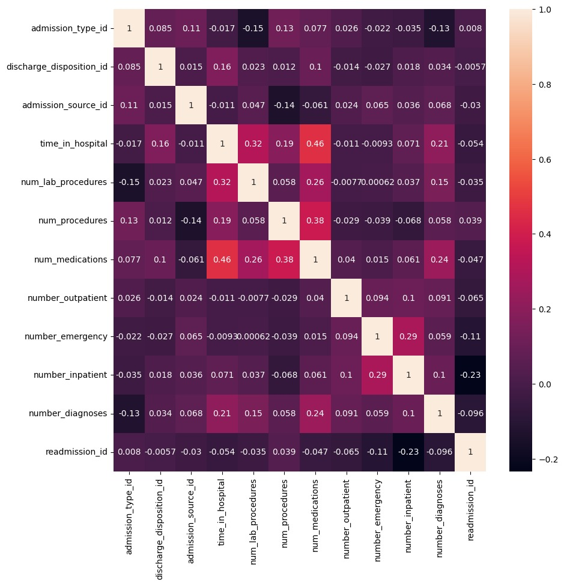

---

Plots to show how `readmission_id` is distributed across different grouped categories of `diag_1`, `diag_2`, `diag_3`.

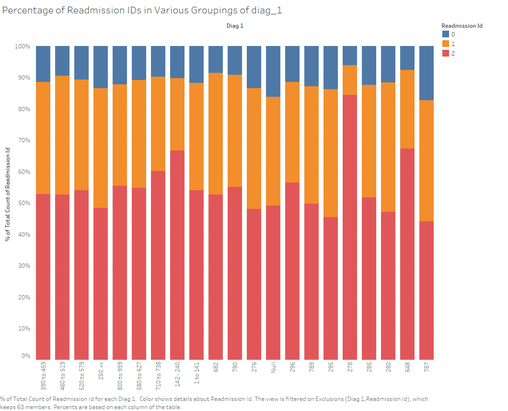
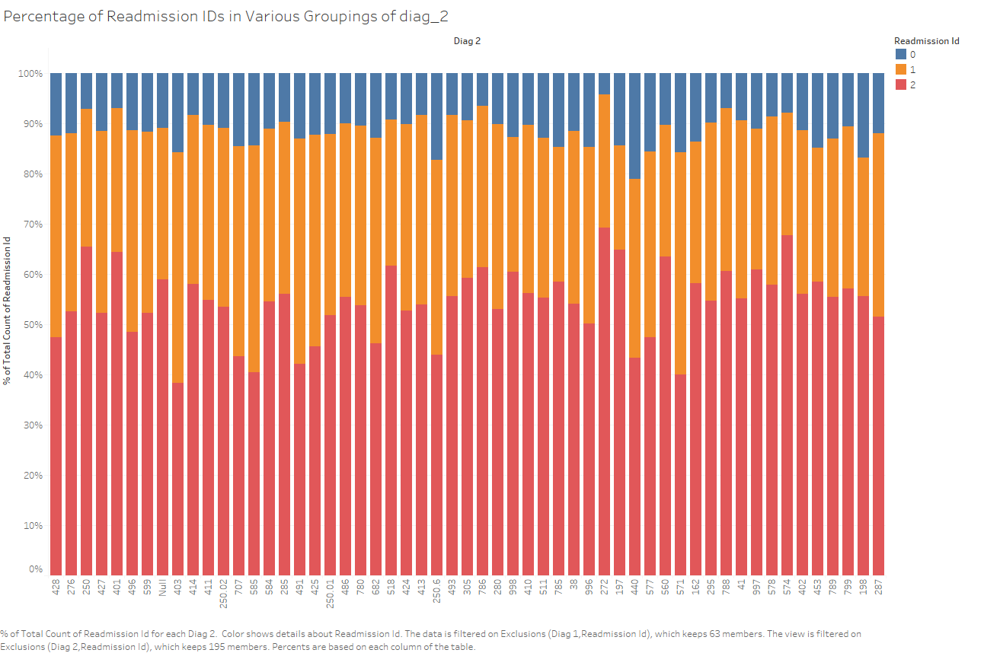
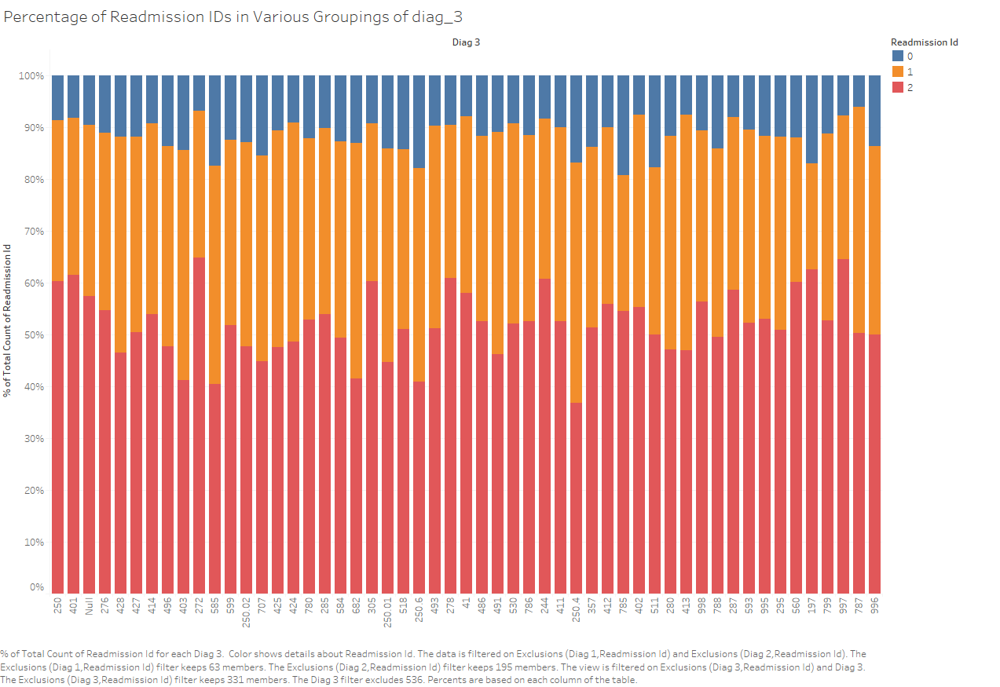

---

Distribution of `readmission_id` across age

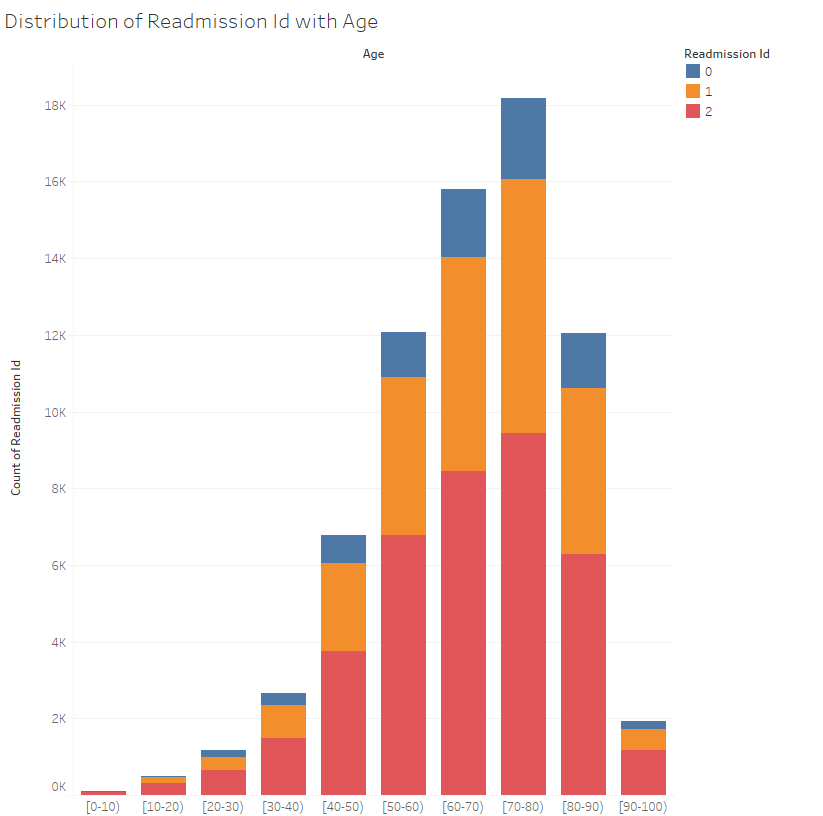

---

Distribution of `readmission_id` across patient_id

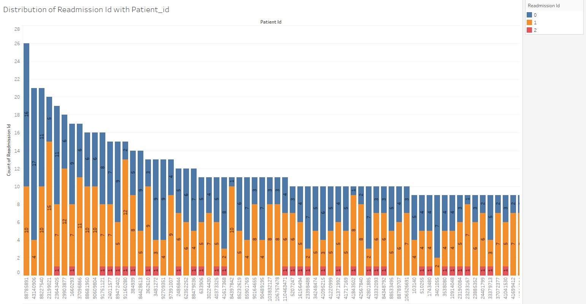

---

Distribution of `readmission_id` with `num_lab_procedures`

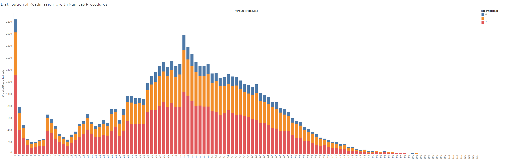

---

Distribution of `readmission_id` across genders

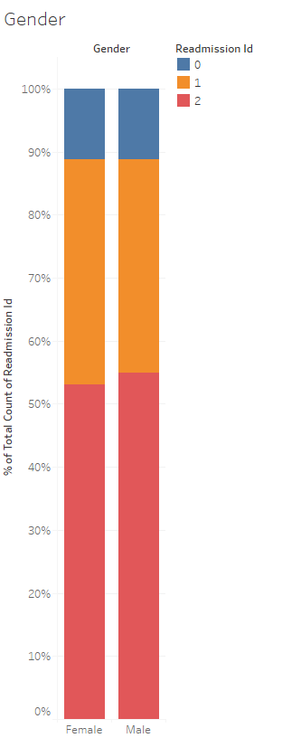

---

Distribution of `readmission_id` across races

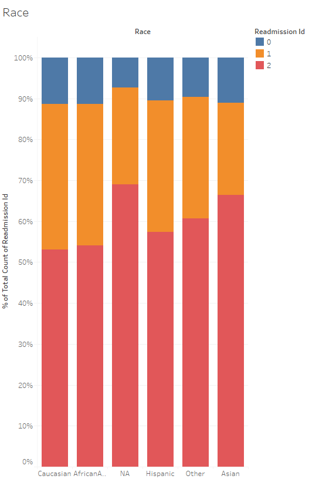

---

Distribution of `readmission_id` across A1Cresults

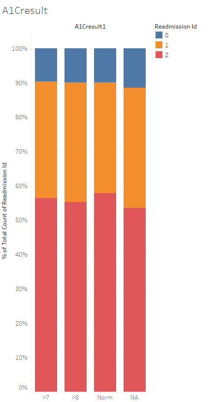

---

Distribution of `readmission_id` across `max_glu_serum` ranges

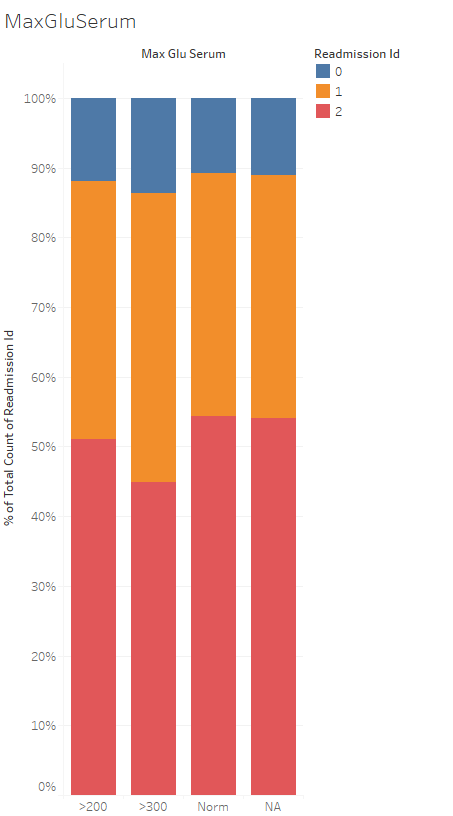

- Tools used for plotting were Tableau and Seaborn.
# Data Processing
### Dropping Columns
| Column Dropped | Reason |
| ----------------- | -------- |
| payer_code | 39.55% null values, does not affect readmission of a patient |
| weight | 96.84% null values |
| max_glu_serum | 94.77% null values |
| A1Cresult | 83.32% null values |
| patient_id | Replaced with a new column to reflect the frequency of patient_id in data |
| Columns corresponding to drug dosage | Dropped after introducing 4 new columns to reflect the count of *Up*, *Down*, *No*, and *Steady* for each encounter_id |
| diag_1, diag_2, diag_3 | Dropped after experimenting with various sub-groupings of these columns and dropping the rest. No significant improvement was observed in validation score. |
### Dropping null rows
We initially considered dropping rows corresponding to null values in *race*, *diag_1*, *diag_2*, and *diag_3* as they had *2.27*%, *0.02*%, *0.34*%, and *1.38*% null values respectively. We observed that this did not improve our validation score, when compared with imputing values.
### Imputing
For all categorical columns, null values were imputed with a new category, denoted by *"0"*.
For all numerical columns, none of them were observed to have null values.
Prior to this, we experimented by imputing with mode, the validation accuracy decreased slightly, prompting us to rethink our strategy.
### Outlier Detection
We tried outlier detection on the numerical columns, ['time_in_hospital', 'num_lab_procedures', 'num_procedures', 'num_medications', 'number_diagnoses']

It was observed that removing these outliers improved the validation score but did not generalize well to unseen data when submitted to Kaggle. We believe this is due to the fact that number of rows in the validation set decreased, leading to a higher validation score.

The definition for upper and lower whiskers is as follows:
```python
Q1 = df_copy[attr].quantile(0.25)   # 1st quartile
Q3 = df_copy[attr].quantile(0.75)   # 3rd quartile
IQR = Q3 - Q1                       # Inter-quartile range
lower_whisker = Q1 - 1.5 * IQR
upper_whisker = Q3 + 1.5 * IQR
```
### Grouping Columns

#### Diagnosis Columns (diag_1, diag_2, diag_3)
Grouping Function
```python
def change_diagnosis(value):    
    if value >= 1 and value <= 139:
        return "D1"
    elif value <= 239:
        return "D2"
    elif value <= 279:
        return "D3"
    elif value <= 289:
        return "D4"
    elif value <= 319:
        return "D5"
    elif value <= 389:
        return "D6"
    elif value <= 459:
        return "D7"
    elif value <= 519:
        return "D8"
    elif value <= 579:
        return "D9"
    elif value <= 629:
        return "D9"
    elif value <= 679:
        return "D10"
    elif value <= 709:
        return "D11"
    elif value <= 739:
        return "D12"
    elif value <= 759:
        return "D13"
    elif value <= 779:
        return "D14"
    elif value <= 799:
        return "D15"
    elif value <= 999:
        return "D16"
    elif value == 1000:
        return "D17"
    else:
        return "D0"
```

This grouping strategy followed the standard ICD9 Codes. These categorical values were later one-hot encoded. However, it was later noticed that this grouping did not increase the validation score on Kaggle, we decided to drop the 3 columns. This provided a significant boost in terms of training time.
#### Age variable
In order to deal with the categorical variable `age` which has values like [0-10), [10-20) and so on, we tried the following approaches: 

- We tried label encoding the variable. Label encoding captures the inherent order of the age categories. The label encoding would assign consecutive numerical values, such as 0 for [0-10), 1 for [10-20), 2 for [20-30), and so on. This maintains the natural order, allowing the algorithm to understand and leverage the ordinal nature of the data.
```python
label_encoder = LabelEncoder()
df["age"] = label_encoder.fit_transform(df["age"])
```

- We also tried an average-based approach to convert the column to a numerical variable:

```python
def change_age(value):
    if(value == '[0-10)'):
        return 5
    elif(value == '[10-20)'):
        return 15
    elif(value == '[20-30)'):
        return 25
    elif(value == '[30-40)'):
        return 35
    elif(value == '[40-50)'):
        return 45
    elif(value == '[50-60)'):
        return 55
    elif(value == '[60-70)'):
        return 65
    elif(value == '[70-80)'):
        return 75
    elif(value == '[80-90)'):
        return 85
    elif(value == '[90-100)'):
        return 95
```

However we noticed that both these approaches led to a very similar validation score as well as accuracy on Kaggle. Hence, we continued with the Label Encoding approach.
## Feature Engineering
### Counting Changes in Drug Dosage
The different drugs have 4 possible values: `Up`, `Down`, `Steady`, and `No`.

We decided to introduce 4 new columns, each of which counts the number of Up's, Down's, Steady's and No's for each row across all rows. We then drop all the columns that corresponds to drugs.
This was done in order to capture the *change* in these columns, since they were very sparse to begin with (most values were `No`).

```python
drugs_cols = ["metformin", "repaglinide", "nateglinide", "chlorpropamide", "glimepiride", "acetohexamide", "glipizide", "glyburide", "tolbutamide", "pioglitazone", "rosiglitazone", "acarbose", "miglitol", "troglitazone", "tolazamide", "examide", "citoglipton", "insulin", "glyburide-metformin", "glipizide-metformin", "glimepiride-pioglitazone", "metformin-rosiglitazone", "metformin-pioglitazone"]

def count_up(row):
    return sum([1 for col in drugs_cols if row[col] in ['Up']])

def count_down(row):
    return sum([1 for col in drugs_cols if row[col] in ['Down']])

def count_steady(row):
    return sum([1 for col in drugs_cols if row[col] in ['Steady']])

def count_no(row):
    return sum([1 for col in drugs_cols if row[col] in ['No']])

# Apply the function row-wise
df['count_up'] = df.apply(count_up, axis=1)
df['count_down'] = df.apply(count_down, axis=1)
df['count_steady'] = df.apply(count_steady, axis=1)
df['count_no'] = df.apply(count_no, axis=1)
df.drop(drugs_cols, axis=1, inplace=True)
```
### Grouping Numerical values for inpatient / outpatient / emergency
For the number_outpatient, number_emergency and number_inpatient, we tried adding the three values and assigning a new column called num_visits.

```python
df['num_visits'] = df["number_outpatient"] + df["number_inpatient"] + df["number_emergency"]
df.drop(["number_outpatient", "number_inpatient", "number_emergency"],axis=1, inplace = True)
```

However we noticed that this approach led to a very similar validation score to when the three columns existed individually. Hence, we stuck with the 3 original columns.
### Frequency for patient_id
- **Train Data:** We introduced a new column called `f_patient_id` which counts the number of visits for a given patient_id and assigns that number to all rows that corresponds to that patient_id.

```python
df['f_patient_id'] = df['patient_id'].copy(deep=True)
cnt_dict = df['patient_id'].value_counts()
for i in df['patient_id']:
    idx = df[df['f_patient_id'] == i].index
    df.loc[idx, 'f_patient_id'] = cnt_dict[i]
df.drop(['patient_id'], axis=1, inplace=True)
```

- **Test Data:** For the test data, in `f_patient_id`, we added the number of visits for that patient_id, from the train and test data and assign it to that column,

```python
cnt_dict_1 = test_df['patient_id'].value_counts()
test_df['f_patient_id'] = test_df['patient_id'].copy(deep=True)
for i in test_df['patient_id']:
    idx = test_df[test_df['f_patient_id'] == i].index
    if cnt_dict.get(i) != None and cnt_dict[i] != 0:
        test_df.loc[idx, 'f_patient_id'] = cnt_dict_1[i] + cnt_dict[i]
    else:
        test_df.loc[idx, 'f_patient_id'] = cnt_dict_1[i]
```

# Model Selection and Training

### Logistic Regression, KNN Classifier, and Decision Tree Classifier
In our initial attempt to train a model, we made use of *logistic regression, KNN classifier, and Decision Tree Classifier*. We observed that logistic regression and KNN classifier returned poor results and the decision tree classifier returned considerably better results. After tweaking the hyper parameters for a while, the team decided to switch to an ensemble method, *Random Forest Classifier*.
### Random Forest Classifier
Based on the observations from previous assumptions, we tried using random forest classifier to classify the given data. The results obtained were a significant improvement over decision trees after tuning the hyper parameters, but the accuracy score still seemed below par (about *0.57*). Our next approach was to try various boosting techniques to see if they generalize better.
### XGBoost Classifier, CatBoost Classifier
Both models gave significantly better results on the validation set as well as on Kaggle, which were further improved by hyper parameter tuning. The reason they were not chosen as the final model was only due to LGBM Classifier giving slightly better results.
### LGBMClassifier - Final Model Used
We finally decided to make use of LGBM classifier from our set of boosting methods. This model with tuned hyper parameters gave the best results on Kaggle, as well as an validation score on par with XGBoost and CatBoost.
### 2-Model and 3-Model Approaches
Having tried various single model setups , we tried 2 different strategies involving multiple models to improve the prediction accuracy.

The first was creating a 2-model setup. The first model was created to predict whether the `readmission_id` was zero or not. The reason for this choice was that the percentage of records where readmission id was zero is around 10% which is very less. Once a record is classified to have a non-zero `readmission_id`, it is sent to another model which was trained to choose between `readmission_id` 1 or 2. This model was trained only on data which has `readmission_id` 1 or 2. The 2 model setup was an interesting strategy for the problem but the 1 / 2 classifier struggled to classify records correctly, reducing the accuracy of the whole setup. This was the reason why this strategy was dropped.

The 3-model setup trains 3 different models to predict whether a data point has a particular `readmission_id` or not. This way the 3 models predict a particular class with a certain probability. Once the models predict the class with a probability, the `readmission_id` is considered to be the class with maximum probability. This is also a good setup but this idea failed due to the poor accuracy of the classifier for `readmission_id` 1. The class 1 classifier could not find the necessary features to predict class 1 correctly leading to records with `readmission_id` as class 1 to be classified as class 2. This decreased the accuracy of the overall setup *(0.708 on Kaggle)*. Hence we decided to drop both the strategies.
## Hyper parameter Tuning
### Grid Search and Cross Validation
In an attempt to discover the best hyperparameters for some of the above models, we used the `RandomCV` and `GridSearchCV` cross validation methods. The returned hyper parameter values did improve the validation score slightly, but after carefully considering the tradeoff in training time, we decided to use only select hyper parameter values.

**RandomCV**
```python
from sklearn.model_selection import RandomizedSearchCV
# Create the random grid
random_grid = {'n_estimators': [int(x) for x in np.linspace(start = 200, stop = 2000, num = 10)],
                'max_features': ['log2', 'sqrt', 'none'],
                'max_depth': [int(x) for x in range(1, 13)],
                'min_samples_split': [x for x in range(2, 100, 5)],
                'min_samples_leaf': [x for x in range(3, 15)],
                'bootstrap': [True, False],
                'criterion': ['gini', 'entropy', 'log_loss'],
                'oob_score': [True, False],
                'class_weight': ['balanced', 'balanced_subsample']}

# Use the random grid to search for best hyperparameters
# First create the base model to tune
rf = RandomForestClassifier()
# Random search of parameters, using 3 fold cross validation, 
# search across 100 different combinations, and use all available cores
rf_random = RandomizedSearchCV(estimator = rf, param_distributions = random_grid, n_iter = 100, cv = 3, verbose=2, random_state=0, n_jobs = -1, scoring='accuracy')
# Fit the random search model
rf_random.fit(X_train, Y_train)
print(rf_random.best_params_)
```

**GridSearchCV**
```python
from sklearn.model_selection import GridSearchCV
# Create the parameter grid based on the results of random search 
param_grid = {
    'bootstrap': [True],
    'max_depth': [80, 90, 100, 110],
    'max_features': [2, 3],
    'min_samples_leaf': [3, 4, 5],
    'min_samples_split': [8, 10, 12],
    'n_estimators': [100, 200, 300, 1000]
}
# Create a based model
rf = RandomForestClassifier()
# Instantiate the grid search model
grid_search = GridSearchCV(estimator = rf, param_grid = param_grid, cv=3, n_jobs=-1, verbose = 2)

# # Fit the grid search to the data
# grid_search.fit(X_train, Y_train)
print(grid_search.best_params_)
best_grid = grid_search.best_estimator_
```
## Validation
In addition to using Grid Search cross validation as described above, we used `accuracy_score` and `f1_score` metrics to gauge the performance of our model.
We also made use of `confusion_matrix` to understand which classes were being wrongly classified, and made strides to improve predictions based on these insights.
Lastly, for some of the models described earlier, we also made use of the `predict_proba` method to interpret the predicted probabilities of each class, for each test point. 
## Final Results

| Model | Result on Kaggle | Approach |
| -- | -- | -- |
| KNN Classifier | 0.528 | - |
|Random Forest Classifier | 0.564 | One-Hot Encoding after grouping diags |
|Random Forest Classifier | 0.566 | One-Hot Encoding after grouping diags, admission_source_id, admission_type_id, discharge_disposition_id |
|Random Forest Classifier | 0.574 | Hyper Parameter Tuning |
|Random Forest Classifier | 0.576 | Dropping select drug dosage columns where majority of values belong to one category |
|Random Forest Classifier | 0.578 | Added outlier detection |

| | | |
| - | - | - |
|XGB Classifier | 0.584 | Dropped all diags, no groupings for ids |
|XGB Classifier | 0.598 | Keep enc_id, patient_id |
|LGBM Classifier | 0.604 | Switched to LGBM classifier |
|LGBM Classifier | 0.609 | Hyper Parameter Tuning |
|LGBM Classifier | 0.608 | Hyper Parameter Tuning |
|LGBM Classifier | 0.637 | Use frequency of patient_id as a column |
|LGBM Classifier | 0.643 | Hyper Parameter Tuning |
|LGBM Classifier | 0.648 | test_patient_id_freq = train_patient_freq |
|LGBM Classifier | 0.721 | test_patient_id_freq = train_patient_freq + test_patient_freq. Count Up, Down, No, and Steady separately in drug dosage columns |
|LGBM Classifier | 0.725 | Hyper Parameter Tuning  |

Best Accuracy with 3-model approach: 0.708 on Kaggle.
**Best Accuracy (Overall)** = *0.725 on Kaggle*

---
